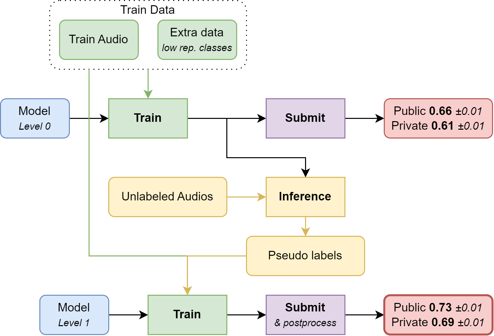

# birdclef-2024 - CPMP's part

Solution to Birdclef 2024 challenge on Kaggle, CPMP part. The full solution is described in [Kaggle forums](https://www.kaggle.com/competitions/birdclef-2024/discussion/511905). This is team work with Christof Henkel and Theo Viel.

## Introduction 

Our pipeline is summarized below. A key ingredient of our solution is to use unlabeled soundscapes for pseudo labeling and model distillation. A number of models were trained with the training data, then used to predict labels on 5 second clips from unlabelled soundscapes. These were added to the original training data to train a new set of models used for the final submission. 



### Data

Overall, we relied on knowledge acquired during previous competitions, and added some extra samples to fight class imbalance.

We use this year’s competition data plus the additional data from Xeno Canto shared in the forum, plus records from previous year competitions for the same species as this year. We capped the number of records per species to 500, keeping the most recent ones.

For each record we use a random crop of 5 seconds clip among the first 6 seconds, or optionally the last 6 seconds. For most of the models we used time shifting with a one second window as the only augmentation besides mixup. We use an additive mixup: mixed labels are the max of the labels of the two audios to be mixed.
We mostly use image models that take log mel spectrograms as input. For these we compute mel spectrograms with parameters chosen to have an image size of 224x224 .

### Models

#### First Level models

The cpu-only requirement was quite constraining for submissions, but this does not apply for pseudo-label generation, so we could use more backbones for first level models. When ensembling several models larger than the ones used at second level we perform what is known as model distillation. This is a rather powerful technique in general.

This pipeline uses a variety of CNNs (efficientnets, mobilenets, tinynets, mnasnets, mixnets) and Efficientvits ([b0, b1](https://arxiv.org/pdf/2205.14756), [m3](https://arxiv.org/pdf/2305.07027) trained on 224x224 log mel spectrograms.

#### Second Level models

Efficientvit-b0 showed great performances while still being very fast to infer. 5 folds take 40 minutes to submit using ONNX. We tried several models with similar throughput to effvit-b0, and decided to also use an mnasnet-100 for diversity. For training second level models we added the unlabelled soundscapes with the predicted pseudo labels to the training data. This looks simple but it took several attempts to find the correct way to do it. What worked fine was to use rather large batch sizes (128), and add a similar amount of pseudo labeled samples. 

## The code

My code was all in notebooks given the data and the models I used were small and did not require any distributed training.

The code was run with nivida NGC container `nvidia/pytorch:24.02-py3`

I pip installed torchaudio, torchvision and timm packages in that container, then ran the notebooks.

## Data

The data needs to be downloaded from Kaggle. It includes data from these competitions and datasets:

- https://www.kaggle.com/competitions/birdclef-2024 (the competition data)
- https://www.kaggle.com/competitions/birdclef-2023 (past competition)
- https://www.kaggle.com/competitions/birdclef-2022 (past competition)
- https://www.kaggle.com/competitions/birdclef-2021 (past competition)
- https://www.kaggle.com/competitions/birdsong-recognition (past competition)
- https://www.kaggle.com/datasets/ludovick/birdclef2024-additional-mp3 (additional data from Xeno Canto)

The data should be put in directories this way:
```
input
├── birdclef-2024               # From the competition data
├── Birdclef20                  # From https://www.kaggle.com/competitions/birdsong-recognition
├── Birdclef21                  # From https://www.kaggle.com/competitions/birdclef-2021
├── Birdclef22                  # From https://www.kaggle.com/competitions/birdclef-2022
├── Birdclef23                  # From https://www.kaggle.com/competitions/birdclef-2023
├── birdclef2024-additional-mp3 # From ludovick's dataset
├── checkpoints                 # populated by notebooks 234 and 237
└── birdclef_data               # created and populated by notebook 002 and 210
```
## Running the solution

Once the data is downloaded and unzipped in the above directories, run the notebooks in the following order.

The notebook 002 processes this year competition data. For the training data it saves numpy versions of 10 second clips from the start and the end of each record. It also saves each sourdscape data as a numpy array.

The notebook 210 creates an index of additional data from ludovick's dataset

The notebook 210 processes past competitions data and ludovick's dataset. It only saves data from the same species as this year competition. It also only saves data for species having less than 500 samples in the compeititon data. 

The notebook 234 trains 5 first level efficientvit_b0 models then predicts pseudo labels on unlabelled soundscapes. These are saved together with mdoel checkpoints in a directory printed near the start of the notebook. That directory needs to be cut and past into the next notebook.

The notebook 237 trains 5 second level efficientvit_b0 models. The pseudo labels for unlabelled soundscapes are read from the directory populated by the notebook 234. That directory must be set as the value of `cfg.pl` in the first cell of notebook 237.
